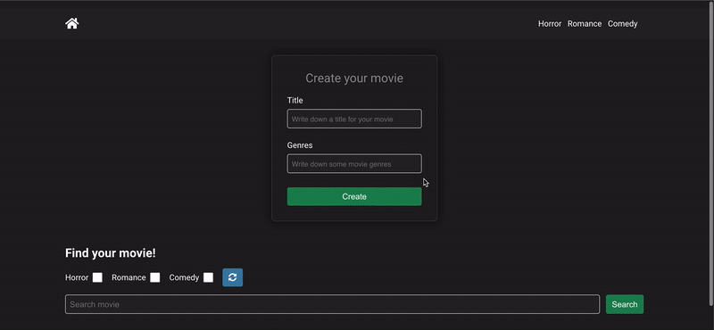
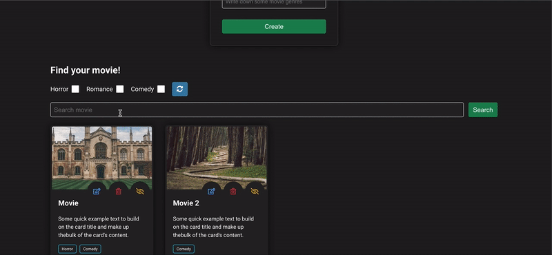

### Movie App

Movie app is a project made with **React** framework which represents a simple Movie App scheduler, where you can create, edit, and schedule by viewed/unviewed your favorite movies.

### Images

Some images of desktop and mobile images

##### - Desktop version flow 1/2



##### - Desktop version flow 2/2



##### - Mobile version flow


### Scripts

1. To run aplication in local enviroment execute `npm run start`

2. To run tests in local enviroment execute `npm run test`

### Scaffolding

```
movies-pbs
├─ .gitignore
├─ package-lock.json
├─ package.json
├─ public
│  ├─ favicon.ico
│  ├─ img
│  │  ├─ desktop-1.gif
│  │  ├─ desktop-2.gif
│  │  ├─ mobile-1.gif
│  │  └─ mobile-2.gif
│  ├─ index.html
│  ├─ logo192.png
│  ├─ logo512.png
│  ├─ manifest.json
│  └─ robots.txt
├─ src
│  ├─ @types
│  │  └─ index.d.ts
│  ├─ App.tsx
│  ├─ _test
│  │  ├─ App.test.jsx
│  │  ├─ misc
│  │  │  ├─ Button.test.tsx
│  │  │  ├─ Filters.test.tsx
│  │  │  ├─ Input.test.tsx
│  │  │  ├─ Loader.test.tsx
│  │  │  ├─ Navbar.test.tsx
│  │  │  ├─ SearchBar.test.tsx
│  │  │  └─ __snapshots__
│  │  │     ├─ Button.test.tsx.snap
│  │  │     ├─ Filters.test.tsx.snap
│  │  │     ├─ Input.test.tsx.snap
│  │  │     ├─ Loader.test.tsx.snap
│  │  │     ├─ Navbar.test.tsx.snap
│  │  │     └─ SearchBar.test.tsx.snap
│  │  ├─ movies
│  │  │  ├─ Card.test.tsx
│  │  │  ├─ Form.test.tsx
│  │  │  ├─ GenreTab.test.tsx
│  │  │  ├─ MovieList.test.tsx
│  │  │  └─ __snapshots__
│  │  │     ├─ Card.test.tsx.snap
│  │  │     ├─ Form.test.tsx.snap
│  │  │     ├─ GenreTab.test.tsx.snap
│  │  │     └─ MovieList.test.tsx.snap
│  │  ├─ screens
│  │  │  ├─ Detail.test.tsx
│  │  │  ├─ Home.test.tsx
│  │  │  └─ __snapshots__
│  │  │     ├─ Detail.test.tsx.snap
│  │  │     └─ Home.test.tsx.snap
│  │  └─ utils
│  │     ├─ mocks
│  │     │  └─ mock.js
│  │     └─ test-utils.tsx
│  ├─ assets
│  │  ├─ _colors.scss
│  │  ├─ _grid.scss
│  │  ├─ _normalize.scss
│  │  ├─ _utils.scss
│  │  └─ _variables.scss
│  ├─ components
│  │  ├─ misc
│  │  │  ├─ button
│  │  │  │  ├─ index.scss
│  │  │  │  └─ index.tsx
│  │  │  ├─ filters
│  │  │  │  └─ index.tsx
│  │  │  ├─ input
│  │  │  │  ├─ index.scss
│  │  │  │  └─ index.tsx
│  │  │  ├─ loader
│  │  │  │  ├─ index.scss
│  │  │  │  └─ index.tsx
│  │  │  ├─ navbar
│  │  │  │  └─ index.tsx
│  │  │  ├─ search-bar
│  │  │  │  ├─ index.scss
│  │  │  │  └─ index.tsx
│  │  │  └─ skeletons
│  │  │     └─ movie
│  │  │        ├─ index.scss
│  │  │        └─ index.tsx
│  │  └─ movies
│  │     ├─ card
│  │     │  ├─ index.scss
│  │     │  └─ index.tsx
│  │     ├─ form
│  │     │  ├─ index.scss
│  │     │  └─ index.tsx
│  │     ├─ genre-tab
│  │     │  ├─ index.scss
│  │     │  └─ index.tsx
│  │     └─ list
│  │        └─ index.tsx
│  ├─ constants.js
│  ├─ hooks
│  │  └─ useKeypress.ts
│  ├─ index.js
│  ├─ index.scss
│  ├─ react-app-env.d.ts
│  ├─ reportWebVitals.js
│  ├─ screens
│  │  ├─ detail
│  │  │  └─ index.tsx
│  │  └─ home
│  │     └─ index.tsx
│  ├─ services
│  │  ├─ BaseService.js
│  │  └─ ImageService.js
│  ├─ setupTests.js
│  └─ store
│     ├─ index.ts
│     └─ reducers
│        ├─ filtersReducer.ts
│        ├─ loadingReducer.ts
│        └─ moviesReducer.ts
├─ tsconfig.json
└─ tsconfig.spec.json

```

This project was created with **create-react-app** template, based on the following requirements:

#### Components and structure

- Redux to implement state handling.
- Form with title and genres input yo create new movie.
- Navbar with routes to "/detail?genre=GENRE"
- Movie card that shows:

  i. Checkbox that shows if movie is watched or not.
  ii. Movie name.
  iii. Genres. Onclick in every genre tab goes to "/detail?genre=GENRE"
  iv. Delete button.
  v. Action buttons -> viewed state | delete movie | edit title.
  
- Filters checkboxes with Horror, Romance, Comedy and a reset button.
- Searchbar as an input above the list and below the radio buttons where user can search the
  movies based on their name.
- Loader when adding a movie or deleting a movie or searching for a movie.
  The delay should be 3 seconds.
- Routing management that handles routes like "/?genre=romance", that redirects to a new page which
  showing the loader for 3 seconds and then only movies which have that genre.

#### Testing

- Testing with react-testing-library, async tests and Jest.
- All tests include between 2 - 4 steps and cases depending on complexity of the component.
